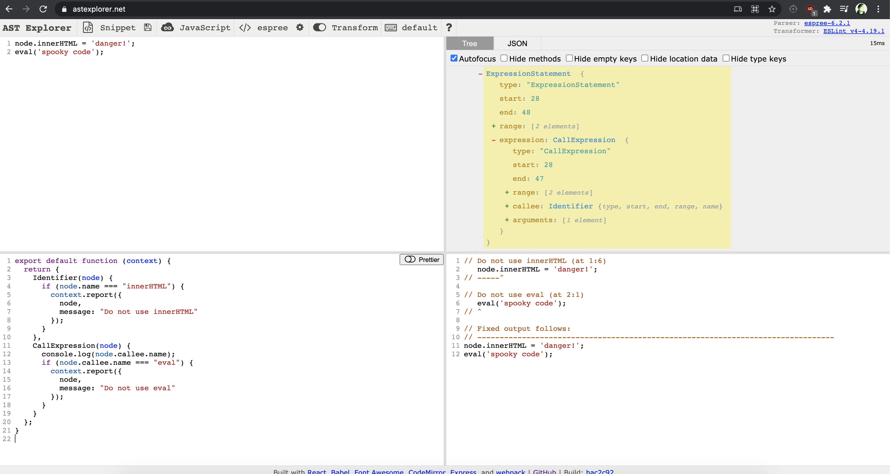

# Eslint-plugin-security

[ASTExplorer](https://astexplorer.net/)
- parser -> Espree
- transform -> eslint v4



## Adding a new rule

```bash
npm i -g yo generator-eslint
cd eslint-plugin-security
yo eslint:rule
```

## Running tests

```bash
npm run test
```